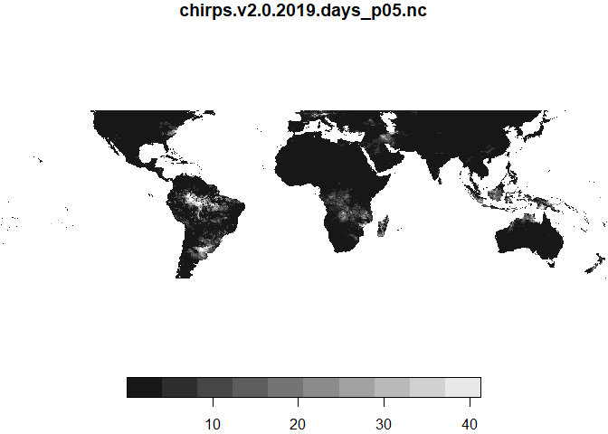
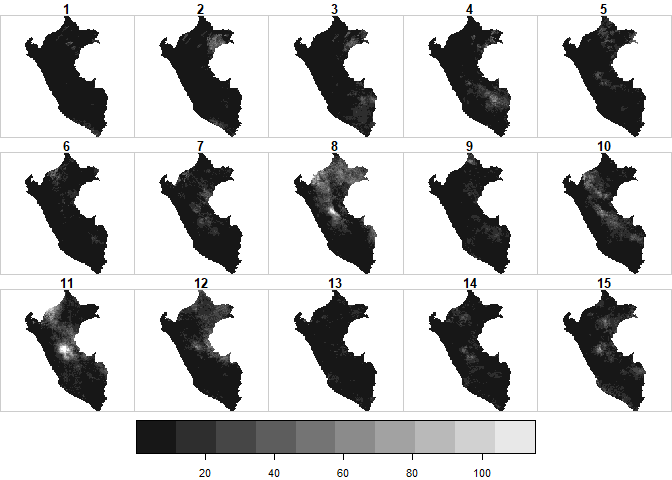
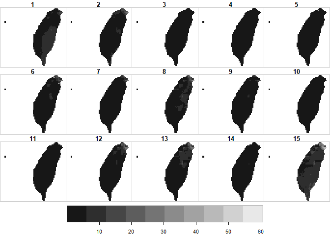
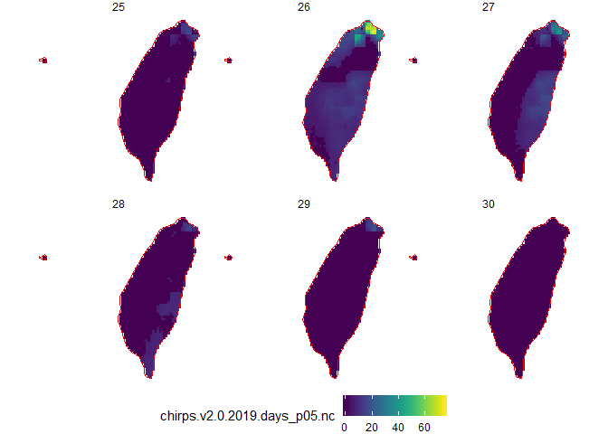

chirps-stars
================

*Exploration of CHIRPS data using R and the stars package for handling NetCDF files.*

CHIRPS data
-----------

"The Climate Hazards Group Infrared Precipitation with Station data (CHIRPS) is a high-resolution climatic database of precipitation embracing monthly precipitation climatology, quasi-global geostationary thermal infrared satellite observations from the Tropical Rainfall Measuring Mission (TRMM) 3B42 product, atmospheric model rainfall fields from National Oceanic and Atmospheric Administration – Climate Forecast System (NOAA CFS), and precipitation observations from various sources." (Retalis et al. 2017)

Overall it is a combination of station-base observations around the world, and satellite derived data for meteorology, including TRMM and NOAA, which are normally used for precipitation analysis.

The data covers information from 1981 to the present on a daily, monthly, yearly and decadal basis. It spans latitudes between 50°S and 50°N and all longitudes. The data is presented in a raster format with a cell siye of 0.05° or 0.25°. Each of the cells represent a rain gauge (Funk et al. 2015).

Data download
-------------

The global daily data which will be analyzed can be downloaded per year, either as a NetCDF file, where each band corresponds to a day; or daily as TIFF files. In this case I decided to work with NetCDF files and will explain how to explore the data using R and the `stars`package.

To explore initially the data, I will use the year 2019 at 0.05° resolution, which has information up to February. The updated data can be downloaded from this link (<ftp://ftp.chg.ucsb.edu/pub/org/chg/products/CHIRPS-2.0/global_daily/netcdf/p05/>)[1].

Manipulating the data in R
--------------------------

The focus of this data exploration is to use NetCDF files in R. This file format is meant for array oriented storage. It can have multiple dimesions and its applications span climatology, meteorology, oceanography, and general GIS data handling.

Packages such as `netcdf4` and `RNetCDF` are meant to handle such data in R. However, the new `stars` package is a promising approach to integrate NetCDF files with existing spatial packages for R, i.e. `sf`.

``` r
devtools::install_github('r-spatial/stars')
```

To load the data, `stars` makes use of its generic `read_stars` function which allows reading raster/array data. The function `read_ncdf` is also available and uses the netcdf package directly to load. We load the data as a `stars_proxy` object which allows for faster manipulation of the data.

``` r
library(stars)
```

    ## Loading required package: abind

    ## Loading required package: sf

    ## Linking to GEOS 3.6.1, GDAL 2.2.3, PROJ 4.9.3

``` r
chirps19 <- read_stars('chirps-v2.0.2019.days_p05.nc', proxy = T)
chirps19
```

    ## stars_proxy object with 1 attribute in file:
    ## $`chirps-v2.0.2019.days_p05.nc`
    ## [1] "chirps-v2.0.2019.days_p05.nc"
    ## 
    ## dimension(s):
    ##      from   to offset delta refsys point values    
    ## x       1 7200     NA    NA     NA    NA   NULL [x]
    ## y       1 2000     NA    NA     NA    NA   NULL [y]
    ## band    1   59     NA    NA     NA    NA   NULL

the data is not really loaded into R's memory but only accessed when necessary. Basic subsetting functions can be applied. For this, we can use the `tidyverse` functions by using the `dplyr` package.

``` r
library(dplyr)
```

    ## 
    ## Attaching package: 'dplyr'

    ## The following objects are masked from 'package:stats':
    ## 
    ##     filter, lag

    ## The following objects are masked from 'package:base':
    ## 
    ##     intersect, setdiff, setequal, union

``` r
library(magrittr)
chirps19 %>% slice(band, 13) %T>% plot(breaks = 'equal')
```



    ## stars_proxy object with 1 attribute in file:
    ## $`chirps-v2.0.2019.days_p05.nc`
    ## [1] "chirps-v2.0.2019.days_p05.nc"
    ## 
    ## dimension(s):
    ##      from   to offset delta refsys point values    
    ## x       1 7200     NA    NA     NA    NA   NULL [x]
    ## y       1 2000     NA    NA     NA    NA   NULL [y]
    ## band    1   59     NA    NA     NA    NA   NULL    
    ## call list:
    ## [[1]]
    ## x[i = TRUE, , , 13, drop = TRUE]

The plotting works with a different cell size, but this is only for speed purposes and is not the actual resolution. If we extract a smaller study area we can see this change.

For this we can first take a look at the `rnaturalearth` packages.

``` r
library(rnaturalearth)
library(rnaturalearthdata)
world <- ne_countries(scale = 'medium', returnclass = 'sf')
taiwan <- world %>% filter(admin == 'Taiwan')
peru <- world %>% filter(admin == 'Peru')
```

The CRS should be the same for the clipping object and the precipitation data.

``` r
st_crs(world)
```

    ## Coordinate Reference System:
    ##   EPSG: 4326 
    ##   proj4string: "+proj=longlat +datum=WGS84 +no_defs"

However, there are some issues with the NetCDF file projection. The delta and offset values are not set. Hence, we will take them from the same data but on the TIFF version.

``` r
chirps_tif <- read_stars('chirps-v2.0.2019.02.28.tif', proxy = T)
chirps_tif
```

    ## stars_proxy object with 1 attribute in file:
    ## $`chirps-v2.0.2019.02.28.tif`
    ## [1] "chirps-v2.0.2019.02.28.tif"
    ## 
    ## dimension(s):
    ##   from   to offset delta                       refsys point values    
    ## x    1 7200   -180  0.05 +proj=longlat +datum=WGS8... FALSE   NULL [x]
    ## y    1 2000     50 -0.05 +proj=longlat +datum=WGS8... FALSE   NULL [y]

Projecting the NetCDF file will follow the next procedure:

``` r
chirps19_proj <- chirps19 %>% st_set_crs(st_crs(chirps_tif))

attr(chirps19_proj, 'dimensions')[[1]]$delta = attr(chirps_tif, 'dimensions')[[1]]$delta
attr(chirps19_proj, 'dimensions')[[2]]$delta = attr(chirps_tif, 'dimensions')[[2]]$delta
attr(chirps19_proj, 'dimensions')[[1]]$offset = attr(chirps_tif, 'dimensions')[[1]]$offset
attr(chirps19_proj, 'dimensions')[[2]]$offset = attr(chirps_tif, 'dimensions')[[2]]$offset
```

Once we have this, we can view the data just for the study areas.

``` r
chirps19_proj[peru][,,,1:15] %T>% plot(breaks = 'equal') 
```



    ## stars_proxy object with 1 attribute in file:
    ## $`chirps-v2.0.2019.days_p05.nc`
    ## [1] "chirps-v2.0.2019.days_p05.nc"
    ## 
    ## dimension(s):
    ##      from   to offset delta                       refsys point values    
    ## x    1974 2227   -180  0.05 +proj=longlat +datum=WGS8...    NA   NULL [x]
    ## y    1001 1367     50 -0.05 +proj=longlat +datum=WGS8...    NA   NULL [y]
    ## band    1   59     NA    NA                           NA    NA   NULL    
    ## call list:
    ## [[1]]
    ## x[i = TRUE, , , 1:15]

``` r
chirps19_proj[taiwan][,,,1:15] %T>% plot(breaks = 'equal') 
```



    ## stars_proxy object with 1 attribute in file:
    ## $`chirps-v2.0.2019.days_p05.nc`
    ## [1] "chirps-v2.0.2019.days_p05.nc"
    ## 
    ## dimension(s):
    ##      from   to offset delta                       refsys point values    
    ## x    5966 6039   -180  0.05 +proj=longlat +datum=WGS8...    NA   NULL [x]
    ## y     495  562     50 -0.05 +proj=longlat +datum=WGS8...    NA   NULL [y]
    ## band    1   59     NA    NA                           NA    NA   NULL    
    ## call list:
    ## [[1]]
    ## x[i = TRUE, , , 1:15]

Once we have the data we need, we can really call it into R for further analysis. In this step I will also set the NA value to -9999

``` r
chirps19_peru <- chirps19_proj[peru] %>% st_as_stars() %>% na_if(-9999)
chirps19_taiwan <- chirps19_proj[taiwan] %>% st_as_stars() %>% na_if(-9999)
```

One thing to be aware of is that the projection does not come with the new data, and therefore the process should be repeated.

``` r
chirps19_peru <- chirps19_peru %>% st_set_crs(st_crs(chirps_tif))
attr(chirps19_peru, 'dimensions')[[1]]$delta = attr(chirps_tif, 'dimensions')[[1]]$delta
attr(chirps19_peru, 'dimensions')[[2]]$delta = attr(chirps_tif, 'dimensions')[[2]]$delta
attr(chirps19_peru, 'dimensions')[[1]]$offset = attr(chirps_tif, 'dimensions')[[1]]$offset
attr(chirps19_peru, 'dimensions')[[2]]$offset = attr(chirps_tif, 'dimensions')[[2]]$offset

chirps19_taiwan <- chirps19_taiwan %>% st_set_crs(st_crs(chirps_tif))
attr(chirps19_taiwan, 'dimensions')[[1]]$delta = attr(chirps_tif, 'dimensions')[[1]]$delta
attr(chirps19_taiwan, 'dimensions')[[2]]$delta = attr(chirps_tif, 'dimensions')[[2]]$delta
attr(chirps19_taiwan, 'dimensions')[[1]]$offset = attr(chirps_tif, 'dimensions')[[1]]$offset
attr(chirps19_taiwan, 'dimensions')[[2]]$offset = attr(chirps_tif, 'dimensions')[[2]]$offset
```

With this, we can do better plots by using the `ggplot2` package.

``` r
library(ggplot2)
library(viridis)
```

    ## Loading required package: viridisLite

``` r
ggplot() +
  geom_stars(data = chirps19_peru[,,,27:32]) +
  geom_sf(data = peru, fill = NA, color = 'red') +
  facet_wrap(~band) +
  scale_fill_viridis(na.value = 'white') +
  theme_void() +
  theme(
    legend.position = 'bottom',
    panel.grid.major = element_line(color = 'white')
  )
```


``` r
ggplot() +
  geom_stars(data = chirps19_taiwan[,,,25:30]) +
  geom_sf(data = taiwan, fill = NA, color = 'red') +
  facet_wrap(~band) +
  scale_fill_viridis(na.value = 'white') +
  theme_void() +
  theme(
    legend.position = 'bottom',
    panel.grid.major = element_line(color = 'white')
  )
```



Only a small subset of the 59 days available were taken for visualization. The data itself represents precipitation in mm/day. Just as a small analysis, we can see that there are several NA values for Peru, whereas, for Taiwan, the data seems fairly complete. It seems like the data available will not be suitable for the Cordillera Blanca study area in Peru. Looking at the data in QGIS, I noticed that the data just skips the Kizl glacier. so probably, for this case we still need to look at the SENAMHI data.


References
==========

Funk, Chris, Pete Peterson, Martin Landsfeld, Diego Pedreros, James Verdin, Shraddhanand Shukla, Gregory Husak, et al. 2015. “The climate hazards infrared precipitation with stations—a new environmental record for monitoring extremes.” *Scientific Data* 2 (December). Nature Publishing Group: 150066. doi:[10.1038/sdata.2015.66](https://doi.org/10.1038/sdata.2015.66).

Retalis, Adrianos, Filippos Tymvios, Dimitrios Katsanos, and Silas Michaelides. 2017. “Downscaling CHIRPS precipitation data: an artificial neural network modelling approach.” *International Journal of Remote Sensing* 38 (13). Taylor & Francis: 3943–59. doi:[10.1080/01431161.2017.1312031](https://doi.org/10.1080/01431161.2017.1312031).

[1] ftp links not working in Markdown.
